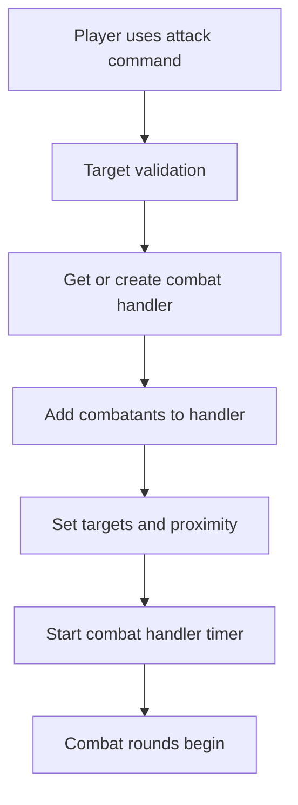
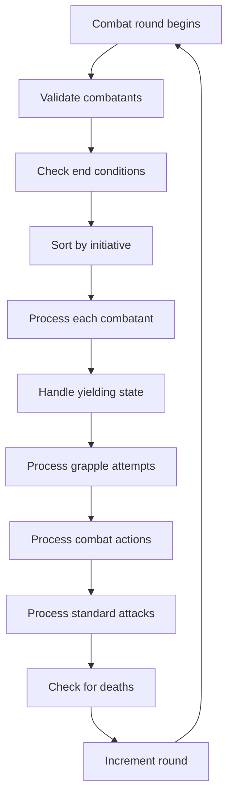

# AGENTS.MD - Combat System Agent Reference

## Overview

NEVER USE EMOJI NEVER USE CURLY QUOTES OR APOSTROPHES NEVER USE EM DASHES!!!!


This document serves as a comprehensive reference for AI agents working on the combat system in Evennia. It provides detailed technical information about the architecture, components, and interactions within the combat system.

## Table of Contents

1. [System Architecture](#system-architecture)
2. [Core Components](#core-components)
3. [Combat Flow](#combat-flow)
4. [Data Structures](#data-structures)
5. [Command System](#command-system)
6. [State Management](#state-management)
7. [Message System](#message-system)
8. [Debugging & Logging](#debugging--logging)
9. [Extension Points](#extension-points)
10. [Common Patterns](#common-patterns)
11. [Troubleshooting](#troubleshooting)

---

## System Architecture

### High-Level Design


```
world/combat/               # Core combat system
├── __init__.py            # Package exports
├── constants.py           # All system constants
├── utils.py               # Utility functions  
├── handler.py             # Main combat handler
├── proximity.py           # Proximity management
├── grappling.py           # Grappling system
└── messages/              # Message templates
    ├── __init__.py        # Message loading system
    ├── unarmed.py         # Unarmed combat messages
    └── [weapon_type].py   # Weapon-specific messages

commands/combat/            # Combat command interface
├── __init__.py
├── core_actions.py        # Attack, stop commands
├── movement.py            # Flee, retreat, advance, charge
├── special_actions.py     # Grapple, disarm, aim
├── info_commands.py       # Look, status commands
└── default_cmdsets.py     # Command set definitions
```

### Design Principles

1. **Modular Architecture**: Each system aspect is contained in focused modules
2. **Constants Centralization**: No magic strings throughout the system
3. **Utility Functions**: Reusable code reduces duplication
4. **Message Organization**: Weapon-specific templates for rich narrative
5. **State Consistency**: Robust state management with cleanup
6. **Debug Infrastructure**: Comprehensive logging and error handling

---

## Core Components

### 1. Combat Handler (`world/combat/handler.py`)

The `CombatHandler` class is the central orchestrator of combat encounters, implemented as an Evennia `DefaultScript`.

**Key Responsibilities:**
- Combat state management and lifecycle
- Turn-based initiative and action resolution
- Multi-room combat coordination through handler merging
- Integration with proximity and grappling systems
- Cleanup and state consistency

**Critical Methods:**
```python
def get_or_create_combat(location):
    """Get existing handler or create new one for a location"""
    
class CombatHandler(DefaultScript):
    def at_script_creation(self):
        """Initialize combat handler attributes"""
        
    def at_repeat(self):
        """Main combat loop - processes each combatant's turn"""
        
    def start(self):
        """Start combat handler timer"""
        
    def stop_combat_logic(self, cleanup_combatants=True):
        """Stop combat logic and optionally cleanup"""
        
    def merge_handler(self, other_handler):
        """Merge another handler into this one"""
        
    def add_combatant(self, char, target=None, **kwargs):
        """Add character to combat"""
        
    def remove_combatant(self, char):
        """Remove character from combat"""
```

**Database Structure:**
```python
self.db.combatants = [
    {
        "char": character_object,
        "target_dbref": target_dbref,
        "grappling_dbref": grappling_dbref,
        "grappled_by_dbref": grappled_by_dbref,
        "is_yielding": boolean,
        "initiative": integer,
        "combat_action": string_or_dict
    }
]
self.db.managed_rooms = [room_objects]
self.db.combat_is_running = boolean
self.db.round = integer
```

### 2. Constants System (`world/combat/constants.py`)

Centralized constants prevent magic strings and improve maintainability.

**Key Categories:**
- **Character Attributes**: G.R.I.M. defaults, HP system
- **Channels & Logging**: Debug prefixes, channel names
- **NDB Fields**: Temporary state field names
- **Database Fields**: Persistent state field names  
- **Message Templates**: Common message patterns
- **Combat Actions**: Action type constants
- **Weapon Types**: Weapon classification

**Critical Constants:**
```python
# Character Stats System
DEFAULT_SMARTS = 1
DEFAULT_BODY = 1
DEFAULT_WILLPOWER = 1
DEFAULT_DEXTERITY = 1
DEFAULT_EDGE = 1
DEFAULT_EMPATHY = 1
DEFAULT_REFLEXES = 1
DEFAULT_TECHNIQUE = 1

# Combat Handler
COMBAT_SCRIPT_KEY = "combat_handler_script"
DB_COMBATANTS = "combatants"
DB_COMBAT_RUNNING = "combat_is_running"
DB_MANAGED_ROOMS = "managed_rooms"

# NDB State Management
NDB_COMBAT_HANDLER = "combat_handler"
NDB_PROXIMITY = "in_proximity_with"
NDB_AIMING_AT = "aiming_at"
NDB_AIMED_AT_BY = "aimed_at_by"

# Debug Prefixes
DEBUG_PREFIX_HANDLER = "HANDLER"
DEBUG_PREFIX_ATTACK = "ATTACK_CMD"
DEBUG_PREFIX_GRAPPLE = "GRAPPLE"
```

### 3. Utilities (`world/combat/utils.py`)

Shared utility functions for common operations.

**Key Function Categories:**
- **Dice & Stats**: Rolling, stat access, opposed rolls
- **Debug Logging**: Standardized debug output
- **Character State**: NDB initialization, proximity management
- **Weapon & Item Helpers**: Weapon detection, damage calculation
- **Message Formatting**: Template processing, safe name display
- **Validation**: Target validation, same-room checks

**Critical Functions:**
```python
def get_character_stat(character, stat_name, default=1):
    """Safely get character stat with fallback"""
    
def roll_stat(character, stat_name, default=1):
    """Roll dice based on character stat"""
    
def opposed_roll(char1, char2, stat1="dexterity", stat2="dexterity"):
    """Perform opposed roll between characters"""
    
def get_wielded_weapon(character):
    """Get character's wielded weapon"""
    
def is_wielding_ranged_weapon(character):
    """Check if character has ranged weapon equipped"""
    
def get_numeric_stat(character, stat_name, default=1):
    """Get numeric stat value with validation"""
```

### 4. Proximity System (`world/combat/proximity.py`)

Manages tactical positioning and melee range requirements.

**Key Concepts:**
- **Bidirectional Proximity**: Characters are mutually in proximity
- **NDB Storage**: Temporary proximity stored in `char.ndb.in_proximity_with`
- **Room Validation**: Proximity only valid within same room
- **Combat Integration**: Proximity required for melee attacks and grappling

**Critical Functions:**
```python
def establish_proximity(char1, char2):
    """Establish bidirectional proximity between characters"""
    
def break_proximity(char1, char2):
    """Break proximity between specific characters"""
    
def clear_all_proximity(character):
    """Clear all proximity relationships for character"""
    
def is_in_proximity(char1, char2):
    """Check if two characters are in proximity"""
    
def get_proximity_list(character):
    """Get list of characters in proximity with given character"""
```

### 5. Grappling System (`world/combat/grappling.py`)

Handles grappling mechanics and state management.

**Key Concepts:**
- **Exclusive Grappling**: Only one character can grapple another at a time
- **Contest Mechanics**: Grapple takeover through dexterity contests
- **Auto-Yielding**: Successful grapples put both parties in restraint mode
- **Escape Mechanics**: Automatic escape attempts for non-yielding victims

**Critical Functions:**
```python
def establish_grapple(combat_handler, grappler, victim):
    """Establish grapple between two characters"""
    
def break_grapple(combat_handler, grappler, victim):
    """Break existing grapple"""
    
def resolve_grapple_initiate(char_entry, combatants_list, handler):
    """Resolve grapple initiation action"""
    
def resolve_grapple_join(char_entry, combatants_list, handler):
    """Resolve grapple join/takeover action"""
    
def validate_and_cleanup_grapple_state(handler):
    """Validate and cleanup stale grapple references"""
```

### 6. Message System (`world/combat/messages/`)

Dynamic message loading system for rich combat narrative.

**Key Features:**
- **Weapon-Specific Messages**: Different messages per weapon type
- **Phase-Based Organization**: Separate messages for initiate, hit, miss, kill
- **Random Selection**: Multiple message variants per phase
- **Fallback System**: Graceful degradation when specific messages missing
- **Template Formatting**: Dynamic content insertion

**Message Structure:**
```python
# In weapon_type.py files
MESSAGES = {
    "initiate": [
        {
            "attacker_msg": "You {action} {target_name}...",
            "victim_msg": "{attacker_name} {action} you...",
            "observer_msg": "{attacker_name} {action} {target_name}..."
        }
    ],
    "hit": [...],
    "miss": [...],
    "kill": [...]
}
```

**Usage:**
```python
from world.combat.messages import get_combat_message

messages = get_combat_message("unarmed", "hit", 
                            attacker=attacker, target=target, 
                            item=weapon, damage=5)
attacker.msg(messages["attacker_msg"])
target.msg(messages["victim_msg"])
location.msg_contents(messages["observer_msg"], exclude=[attacker, target])
```

---

## Combat Flow

### 1. Combat Initiation



**Key Steps:**
1. **Command Processing**: `CmdAttack.func()` validates target and weapon
2. **Handler Creation**: `get_or_create_combat()` ensures single handler per location
3. **Combatant Addition**: Characters added with initial state
4. **Proximity Setup**: Melee proximity established if same room
5. **Timer Start**: Combat handler begins 6-second rounds

### 2. Combat Round Processing



**Combatant Processing Order:**
1. **Validation**: Remove invalid/dead combatants
2. **Yielding Check**: Handle non-violent states
3. **Grapple Handling**: Process being grappled
4. **Action Processing**: Handle special combat actions
5. **Standard Attack**: Process regular attacks
6. **Cleanup**: Clear temporary flags

### 3. Combat Resolution

**End Conditions:**
- **All Yielding**: Peaceful resolution when no active grapples
- **Single Combatant**: Combat ends when ≤1 combatant remains
- **No Combatants**: Handler cleanup when all leave/die
- **Handler Merge**: Combine handlers when combatants cross rooms

---

## Data Structures

### Combat Handler State

```python
class CombatHandler(DefaultScript):
    # Database attributes
    db.combatants = [
        {
            "char": Character,              # Character object
            "target_dbref": int,            # Target's database ID
            "grappling_dbref": int,         # Who they're grappling
            "grappled_by_dbref": int,       # Who's grappling them
            "is_yielding": bool,            # Non-violent state
            "initiative": int,              # Turn order
            "combat_action": str|dict       # Queued action
        }
    ]
    db.managed_rooms = [Room]              # Rooms this handler manages
    db.combat_is_running = bool            # Handler active flag
    db.round = int                         # Current round number
```

### Character NDB State

```python
# Temporary combat state stored in char.ndb
char.ndb.combat_handler = CombatHandler    # Handler reference
char.ndb.in_proximity_with = set()         # Characters in melee range
char.ndb.aiming_at = Character             # Current aim target
char.ndb.aimed_at_by = Character           # Who's aiming at them
char.ndb.aiming_direction = str            # Direction being aimed
char.ndb.skip_combat_round = bool          # Skip next turn
char.ndb.charge_attack_bonus_active = bool # Charge attack bonus
char.ndb.charging_vulnerability_active = bool # Charge vulnerability
```

### Message Structure

```python
# Combat message format
{
    "attacker_msg": str,    # Message to attacker
    "victim_msg": str,      # Message to target
    "observer_msg": str     # Message to observers
}

# Template variables available
{
    "attacker_name": str,   # Attacker's display name
    "target_name": str,     # Target's display name
    "item_name": str,       # Weapon/item name
    "damage": int,          # Damage dealt
    "phase": str,           # Combat phase
    # ... additional context variables
}
```

---

## Command System

### Command Organization

**Core Actions** (`commands/combat/core_actions.py`):
- `CmdAttack`: Primary combat initiation and continuation
- `CmdStop`: Cease aggressive actions, enter yielding state

**Movement Commands** (`commands/combat/movement.py`):
- `CmdFlee`: Escape combat entirely
- `CmdRetreat`: Disengage from melee range
- `CmdAdvance`: Close distance for melee
- `CmdCharge`: Reckless rush attack

**Special Actions** (`commands/combat/special_actions.py`):
- `CmdGrapple`: Initiate grapple with target
- `CmdEscapeGrapple`: Break free from grapple
- `CmdReleaseGrapple`: Release grapple hold
- `CmdDisarm`: Remove target's weapon
- `CmdAim`: Improve accuracy for ranged attacks

**Information Commands** (`commands/combat/info_commands.py`):
- `CmdLook`: Enhanced look with combat info

### Command Implementation Pattern

```python
class CmdExample(Command):
    key = "example"
    locks = "cmd:all()"
    help_category = "Combat"
    
    def func(self):
        caller = self.caller
        
        # 1. Validation
        if not self.args:
            caller.msg("Usage message")
            return
            
        # 2. Target resolution
        target = self.resolve_target(self.args)
        if not target:
            caller.msg("Target not found")
            return
            
        # 3. Combat handler interaction
        handler = get_or_create_combat(caller.location)
        
        # 4. Action processing
        success = self.process_action(handler, caller, target)
        
        # 5. Result messaging
        if success:
            self.send_success_messages(caller, target)
        else:
            self.send_failure_messages(caller, target)
```

### Command Integration Points

**Handler Interaction:**
```python
# Get or create handler
handler = get_or_create_combat(location)

# Add combatants
handler.add_combatant(char, target=target)

# Set combat actions
char_entry["combat_action"] = "grapple_initiate"

# Start handler
if not handler.is_active:
    handler.start()
```

**State Management:**
```python
# Check combat state
if hasattr(char.ndb, "combat_handler"):
    handler = char.ndb.combat_handler
    
# Manage proximity
from world.combat.proximity import establish_proximity
establish_proximity(char1, char2)

# Handle grappling
from world.combat.grappling import establish_grapple
establish_grapple(handler, grappler, victim)
```

---

## State Management

### NDB (Non-Database) Attributes

**Purpose**: Temporary combat state that doesn't persist across restarts

**Key NDB Fields:**
```python
# Combat handler reference
char.ndb.combat_handler = CombatHandler

# Proximity relationships
char.ndb.in_proximity_with = set([char1, char2, ...])

# Aiming system
char.ndb.aiming_at = Character        # Who they're aiming at
char.ndb.aimed_at_by = Character      # Who's aiming at them
char.ndb.aiming_direction = "north"   # Direction being aimed

# Temporary flags
char.ndb.skip_combat_round = True     # Skip next turn
char.ndb.charge_attack_bonus_active = True    # Charge bonus
char.ndb.charging_vulnerability_active = True  # Charge penalty
```

**Management Pattern:**
```python
# Initialize NDB field
if not hasattr(char.ndb, "field_name"):
    char.ndb.field_name = default_value

# Check and use NDB field
if hasattr(char.ndb, "field_name"):
    value = char.ndb.field_name
    # Use value...
    
# Clean up NDB field
if hasattr(char.ndb, "field_name"):
    delattr(char.ndb, "field_name")
```

### Database Persistence

**Handler State**: Stored in `CombatHandler.db` attributes
- Survives server restarts
- Automatically saved by Evennia
- Requires careful management to prevent corruption

**Character State**: Stored in `Character.db` attributes
- Permanent character data (stats, equipment)
- Health, equipment, permanent status effects

**State Cleanup**: Critical for preventing memory leaks and state corruption
```python
def cleanup_combatant_state(char, entry, handler):
    """Clean up all combat-related state for a character"""
    # Clear NDB attributes
    if hasattr(char.ndb, "combat_handler"):
        delattr(char.ndb, "combat_handler")
    
    # Clear proximity relationships
    clear_all_proximity(char)
    
    # Clear grapple states
    break_grapple(handler, char, None)
    
    # Clear aiming states
    clear_aim_state(char)
```

---

## Message System

### Message Loading Architecture

**Dynamic Loading**: Messages loaded at runtime based on weapon type
```python
def get_combat_message(weapon_type, phase, **kwargs):
    """Load message from weapon-specific module"""
    module_path = f"world.combat.messages.{weapon_type}"
    module = importlib.import_module(module_path)
    messages = module.MESSAGES.get(phase, [])
    return random.choice(messages)
```

**Fallback System**: Graceful degradation when specific messages missing
```python
# If weapon-specific message not found, use generic fallback
fallback_template = {
    "attacker_msg": f"You {verb} {{target_name}}.",
    "victim_msg": f"{{attacker_name}} {verb}s you.",
    "observer_msg": f"{{attacker_name}} {verb}s {{target_name}}."
}
```

### Message Categories

**Combat Phases**:
- `"initiate"`: Combat begins, tension building
- `"hit"`: Successful attack
- `"miss"`: Failed attack
- `"kill"`: Fatal blow
- `"grapple"`: Grappling attempts
- `"escape_hit"`: Successful escape
- `"escape_miss"`: Failed escape

**Weapon Types**:
- `"unarmed"`: Fist fighting, kicks, wrestling
- `"blade"`: Knives, swords, sharp weapons
- `"blunt"`: Clubs, hammers, improvised weapons
- `"ranged"`: Guns, bows, thrown weapons

### Message Template System

**Template Variables**:
```python
format_kwargs = {
    "attacker_name": attacker.key,
    "target_name": target.key,
    "item_name": weapon.key,
    "damage": damage_amount,
    "phase": phase_name,
    # Custom variables per message type
}
```

**Color Coding**:
- `|r` - Red for damage/violence
- `|g` - Green for success/healing
- `|y` - Yellow for warnings/non-violent
- `|R` - Bright red for critical hits
- `|n` - Normal color reset

**Usage Example**:
```python
# Get weapon-specific message
weapon_type = weapon.db.weapon_type if weapon else "unarmed"
messages = get_combat_message(weapon_type, "hit", 
                            attacker=attacker, target=target,
                            item=weapon, damage=damage)

# Send to participants
attacker.msg(messages["attacker_msg"])
target.msg(messages["victim_msg"])
location.msg_contents(messages["observer_msg"], exclude=[attacker, target])
```

---

## Debugging & Logging

### Debug Infrastructure

**Splattercast Channel**: Centralized debug output
```python
from evennia.comms.models import ChannelDB
splattercast = ChannelDB.objects.get_channel("Splattercast")
splattercast.msg(f"DEBUG_MESSAGE: {content}")
```

**Debug Prefixes**: Organized debug categories
```python
# Handler operations
DEBUG_PREFIX_HANDLER = "HANDLER"

# Command processing
DEBUG_PREFIX_ATTACK = "ATTACK_CMD"
DEBUG_PREFIX_GRAPPLE = "GRAPPLE"
DEBUG_PREFIX_FLEE = "FLEE_CMD"

# Action types
DEBUG_SUCCESS = "SUCCESS"
DEBUG_FAIL = "FAIL"
DEBUG_ERROR = "ERROR"
DEBUG_CLEANUP = "CLEANUP"
```

**Debug Message Format**:
```python
splattercast.msg(f"{DEBUG_PREFIX_HANDLER}_{DEBUG_SUCCESS}: {message}")
# Output: HANDLER_SUCCESS: Combat handler started for Room #123
```

### Logging Patterns

**State Transitions**:
```python
splattercast.msg(f"HANDLER_START: Handler {self.key} starting combat")
splattercast.msg(f"HANDLER_STOP: Handler {self.key} stopping combat")
splattercast.msg(f"HANDLER_MERGE: Merging {other.key} into {self.key}")
```

**Combat Actions**:
```python
splattercast.msg(f"ATTACK: {attacker.key} (roll {roll1}) vs {target.key} (roll {roll2})")
splattercast.msg(f"GRAPPLE_SUCCESS: {grappler.key} grappled {victim.key}")
splattercast.msg(f"PROXIMITY_ESTABLISH: {char1.key} <-> {char2.key}")
```

**Error Handling**:
```python
try:
    # Combat operation
    result = dangerous_operation()
except Exception as e:
    splattercast.msg(f"ERROR: {operation_name} failed: {e}")
    # Graceful recovery
    return safe_fallback()
```

### Debug Utilities

**Combat State Inspection**:
```python
def debug_combat_state(handler):
    """Log current combat state for debugging"""
    combatants = handler.db.combatants
    splattercast.msg(f"Handler {handler.key}: {len(combatants)} combatants")
    for entry in combatants:
        char = entry["char"]
        target = handler.get_target_obj(entry)
        splattercast.msg(f"  {char.key} -> {target.key if target else 'None'}")
```

**Proximity Debugging**:
```python
def debug_proximity(char):
    """Log proximity relationships for character"""
    if hasattr(char.ndb, "in_proximity_with"):
        proximity = char.ndb.in_proximity_with
        names = [c.key for c in proximity]
        splattercast.msg(f"PROXIMITY: {char.key} with {names}")
```

---

## Extension Points

### Adding New Weapon Types

**1. Create Message File**:
```python
# world/combat/messages/new_weapon.py
MESSAGES = {
    "initiate": [
        {
            "attacker_msg": "You ready your {item_name}...",
            "victim_msg": "{attacker_name} readies their {item_name}...",
            "observer_msg": "{attacker_name} readies their {item_name}..."
        }
    ],
    "hit": [...],
    "miss": [...],
    "kill": [...]
}
```

**2. Configure Weapon Object**:
```python
# In weapon creation
weapon.db.weapon_type = "new_weapon"
weapon.db.is_ranged = False  # or True
weapon.db.damage_bonus = 2
```

**3. Test Integration**:
```python
# Messages automatically loaded by weapon_type
messages = get_combat_message("new_weapon", "hit", ...)
```

### Adding New Combat Actions

**1. Create Command Class**:
```python
class CmdNewAction(Command):
    key = "newaction"
    locks = "cmd:all()"
    help_category = "Combat"
    
    def func(self):
        # Implement action logic
        pass
```

**2. Add to Command Set**:
```python
# In default_cmdsets.py
self.add(CmdNewAction())
```

**3. Handler Integration**:
```python
# In handler.at_repeat()
if combat_action == "new_action":
    self._resolve_new_action(char_entry, combatants_list)
```

### Adding New Status Effects

**1. Define Constants**:
```python
# In constants.py
NDB_NEW_STATUS = "new_status"
MSG_NEW_STATUS_APPLY = "You feel {effect}..."
MSG_NEW_STATUS_REMOVE = "The {effect} fades..."
```

**2. Create Management Functions**:
```python
# In utils.py
def apply_new_status(char, duration):
    """Apply new status effect"""
    char.ndb.new_status = duration
    char.msg(MSG_NEW_STATUS_APPLY.format(effect="new status"))

def remove_new_status(char):
    """Remove new status effect"""
    if hasattr(char.ndb, "new_status"):
        delattr(char.ndb, "new_status")
        char.msg(MSG_NEW_STATUS_REMOVE.format(effect="new status"))
```

**3. Handler Integration**:
```python
# In handler.at_repeat()
if hasattr(char.ndb, "new_status"):
    # Process status effect
    duration = char.ndb.new_status - 1
    if duration <= 0:
        remove_new_status(char)
    else:
        char.ndb.new_status = duration
```

---

## Common Patterns

### Handler Interaction Pattern

```python
# Standard handler interaction
def command_handler_interaction(caller, target):
    # 1. Get or create handler
    handler = get_or_create_combat(caller.location)
    
    # 2. Check if participants are in combat
    caller_in_combat = any(e["char"] == caller for e in handler.db.combatants)
    target_in_combat = any(e["char"] == target for e in handler.db.combatants)
    
    # 3. Add participants if needed
    if not caller_in_combat:
        handler.add_combatant(caller, target=target)
    if not target_in_combat:
        handler.add_combatant(target, target=caller)
    
    # 4. Set combat action
    caller_entry = next(e for e in handler.db.combatants if e["char"] == caller)
    caller_entry["combat_action"] = "desired_action"
    
    # 5. Start handler
    if not handler.is_active:
        handler.start()
```

### State Cleanup Pattern

```python
def cleanup_character_state(char):
    """Clean up all combat state for a character"""
    # Remove handler reference
    if hasattr(char.ndb, "combat_handler"):
        delattr(char.ndb, "combat_handler")
    
    # Clear proximity
    clear_all_proximity(char)
    
    # Clear aiming
    clear_aim_state(char)
    
    # Clear temporary flags
    temp_flags = ["skip_combat_round", "charge_attack_bonus_active", "charging_vulnerability_active"]
    for flag in temp_flags:
        if hasattr(char.ndb, flag):
            delattr(char.ndb, flag)
```

### Message Sending Pattern

```python
def send_combat_messages(weapon_type, phase, attacker, target, location, **kwargs):
    """Standard message sending pattern"""
    messages = get_combat_message(weapon_type, phase, 
                                attacker=attacker, target=target, **kwargs)
    
    # Send to participants
    attacker.msg(messages["attacker_msg"])
    target.msg(messages["victim_msg"])
    
    # Send to observers
    location.msg_contents(messages["observer_msg"], exclude=[attacker, target])
```

### Error Handling Pattern

```python
def safe_combat_operation(operation_name, operation_func, *args, **kwargs):
    """Safe wrapper for combat operations"""
    try:
        return operation_func(*args, **kwargs)
    except Exception as e:
        # Log error
        from evennia.comms.models import ChannelDB
        splattercast = ChannelDB.objects.get_channel("Splattercast")
        splattercast.msg(f"ERROR_{operation_name}: {e}")
        
        # Graceful recovery
        return safe_fallback_value()
```

---

## Troubleshooting

### Common Issues

**1. Handler Not Starting**
```python
# Check handler state
if not handler.is_active:
    handler.start()

# Check combat_is_running flag
if not handler.db.combat_is_running:
    handler.db.combat_is_running = True
    handler.force_repeat()
```

**2. Stale State References**
```python
# Clean up stale NDB references
if hasattr(char.ndb, "combat_handler"):
    handler = char.ndb.combat_handler
    if not handler.is_active:
        delattr(char.ndb, "combat_handler")

# Validate handler references
combatants = handler.db.combatants
valid_combatants = [e for e in combatants if e["char"] and e["char"].location]
handler.db.combatants = valid_combatants
```

**3. Proximity Desync**
```python
# Fix proximity relationships
def fix_proximity(char1, char2):
    """Ensure bidirectional proximity"""
    if not hasattr(char1.ndb, "in_proximity_with"):
        char1.ndb.in_proximity_with = set()
    if not hasattr(char2.ndb, "in_proximity_with"):
        char2.ndb.in_proximity_with = set()
    
    char1.ndb.in_proximity_with.add(char2)
    char2.ndb.in_proximity_with.add(char1)
```

**4. Grapple State Corruption**
```python
# Validate grapple state
def validate_grapple(handler):
    """Ensure grapple state consistency"""
    for entry in handler.db.combatants:
        char = entry["char"]
        grappling_dbref = entry.get("grappling_dbref")
        grappled_by_dbref = entry.get("grappled_by_dbref")
        
        # Check grappling target exists
        if grappling_dbref:
            target = get_character_by_dbref(grappling_dbref)
            if not target:
                entry["grappling_dbref"] = None
                
        # Check grappler exists
        if grappled_by_dbref:
            grappler = get_character_by_dbref(grappled_by_dbref)
            if not grappler:
                entry["grappled_by_dbref"] = None
```

### Debug Commands

**Handler Status**:
```python
# Check handler state
@command
def debug_handler(caller):
    """Debug combat handler state"""
    handler = getattr(caller.ndb, "combat_handler", None)
    if not handler:
        caller.msg("No combat handler")
        return
    
    caller.msg(f"Handler: {handler.key}")
    caller.msg(f"Active: {handler.is_active}")
    caller.msg(f"Running: {handler.db.combat_is_running}")
    caller.msg(f"Round: {handler.db.round}")
    caller.msg(f"Combatants: {len(handler.db.combatants)}")
    
    for entry in handler.db.combatants:
        char = entry["char"]
        target = handler.get_target_obj(entry)
        caller.msg(f"  {char.key} -> {target.key if target else 'None'}")
```

**Proximity Status**:
```python
@command
def debug_proximity(caller):
    """Debug proximity relationships"""
    if not hasattr(caller.ndb, "in_proximity_with"):
        caller.msg("No proximity data")
        return
    
    proximity = caller.ndb.in_proximity_with
    caller.msg(f"In proximity with: {[c.key for c in proximity]}")
```

### Performance Monitoring

**Combat Load**:
```python
def monitor_combat_load():
    """Monitor system combat load"""
    from evennia.scripts.models import ScriptDB
    handlers = ScriptDB.objects.filter(db_key="combat_handler_script", db_is_active=True)
    
    total_combatants = 0
    for handler in handlers:
        combatants = getattr(handler.db, "combatants", [])
        total_combatants += len(combatants)
    
    return {
        "active_handlers": len(handlers),
        "total_combatants": total_combatants,
        "avg_combatants_per_handler": total_combatants / len(handlers) if handlers else 0
    }
```

---

## Conclusion

This document provides a comprehensive reference for working with the combat system. The modular architecture, robust state management, and extensive debugging infrastructure make it a powerful and maintainable combat system.

### Key Takeaways

1. **Modular Design**: Each component has a clear responsibility
2. **State Management**: Careful handling of persistent and temporary state
3. **Error Handling**: Robust error recovery and logging
4. **Extensibility**: Clear patterns for adding new features
5. **Debug Infrastructure**: Comprehensive logging and monitoring

### Best Practices

- Always use constants instead of magic strings
- Clean up state when characters leave combat
- Validate handler references before use
- Use debug logging for complex operations
- Follow established patterns for new features

---

*This document is maintained alongside the combat system code and should be updated when significant changes are made to the system architecture.*
